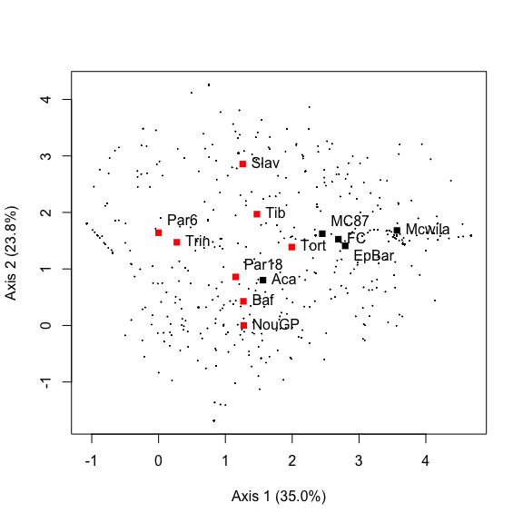
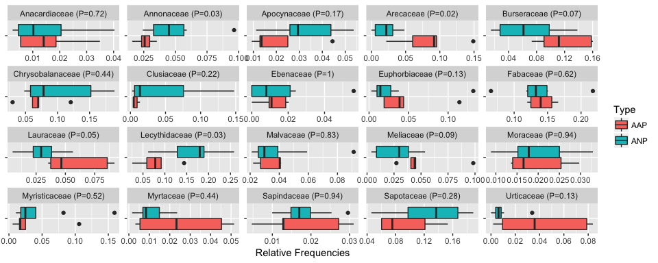

CouacAnalyses
================
Bruno Hérault
12/16/2017

-   [Materials and Methods](#materials-and-methods)
    -   [Sampled forests](#sampled-forests)
    -   [Archaeological diagnosis](#archaeological-diagnosis)
        -   [Prospection](#prospection)
        -   [Dating](#dating)
    -   [Effect of anthropization on tree assemblages](#effect-of-anthropization-on-tree-assemblages)
        -   [Forest Composition](#forest-composition)
        -   [Botanical Families](#botanical-families)
        -   [Indicator Species](#indicator-species)
        -   [Diversity](#diversity)
    -   [Ethnobotanical surveys](#ethnobotanical-surveys)
        -   [Ethics in ethnobotanical data access](#ethics-in-ethnobotanical-data-access)
        -   [Data collection](#data-collection)
        -   [Creation of a single ethnobotanical database](#creation-of-a-single-ethnobotanical-database)
        -   [Uses and parts categories](#uses-and-parts-categories)
        -   [Synthetic use values](#synthetic-use-values)
        -   [Testing local assemblages](#testing-local-assemblages)
-   [Results](#results)
    -   [Effect of pre-columbian anthropization on current tree communities](#effect-of-pre-columbian-anthropization-on-current-tree-communities)
        -   [Forest composition](#forest-composition-1)
        -   [Botanical Families](#botanical-families-1)
        -   [Indicator Species](#indicator-species-1)

Materials and Methods
=====================

Sampled forests
---------------

This study involved 13 permanent plots, including 12 from the Guyafor network (Grau et al. 2017) distributed throughout the northern two-thirds of French Guiana (Figure 1). All individual trees (≥ 10 cm in diameter-at-breast-height) present in the plots were marked, mapped, measured and botanically identified. The total dataset included 8995 trees. Individuals not determined to the genus level represent 4.02% of all individuals.

| Plot\_Name |  N\_trees|  N\_family|  N\_genera|  N\_species|  Perc\_Determination| Plot\_Area | Type |
|:-----------|---------:|----------:|----------:|-----------:|--------------------:|:-----------|:-----|
| Aca        |       454|         42|         93|         148|                95.59| 1          | AAP  |
| Baf        |       756|         39|        106|         183|                93.65| 1          | ANP  |
| EpBar      |       974|         49|        142|         283|                85.52| NA         | AAP  |
| FC         |       766|         44|        113|         225|                98.04| NA         | AAP  |
| MC87       |       824|         44|        126|         276|                89.56| NA         | AAP  |
| Mcwila     |       654|         41|        103|         174|                98.32| NA         | AAP  |
| NouGP      |       536|         43|        104|         169|                89.37| 1          | ANP  |
| Par18      |       499|         42|        103|         158|                96.39| 1          | ANP  |
| Par6       |       964|         41|        106|         189|                94.19| 1.56       | ANP  |
| Slav       |       620|         44|        106|         200|                88.23| 1          | ANP  |
| Tib        |       440|         41|        114|         176|                95.00| 1          | ANP  |
| Tort       |       496|         46|        122|         193|                94.15| 1          | ANP  |
| Trin       |       650|         40|        112|         187|                98.92| 1          | ANP  |

*Description of the Sampled Plots*

Archaeological diagnosis
------------------------

### Prospection

The surface of each plot was diagnosed by archaeologists. Evidence for pre-Columbian human occupations (such as artifacts, dark soils, earthworks) was searched for in the field, by superficial prospection of the ground surface while walking and carefully examining soils expelled from burrows and mounds resulting from uprooted trees. Exploratory, localized pits were also dug to confirm surface observations and to establish archaeological sequences. This allowed classifying plots as either “Apparently Anthropized Plot” (AAP) or “Apparently Non-anthropized Plot” (ANP).

### Dating

Dating was performed by AMS by the Radiocarbon Laboratory (A. Mickiewicz University, Poznań, Poland) following their routine protocol. Briefly, samples of charcoal dug from pits (after mechanical removal of macroscopic contamination visible under a binocular microscope) were treated with 1M HCl (80°C, 20+ min), 0.025-0.2M NaOH and then 0.25M HCl (80°C, 1 hour). After treatment with each reagent, the samples were rinsed with deionized water (Millipore) until pH = 7. Content of 14C in samples of carbon was measured using the spectrometer "Compact Carbon AMS" (National Electrostatics Corporation, USA) as described by Goslar et al. (2004). The measurement was performed by comparing intensities of ionic beams of 14C, 13C and 12C measured for each sample and for standard samples (modern standard: “Oxalic Acid II” and standard of 14C-free carbon: “background”). In each AMS run, 30-33 samples of unknown age were measured, alternating with measurements of 3-4 samples of modern standard and 1-2 samples of background (coal). Conventional 14C age was calculated using correction for isotopic fractionation according to Stuiver and Polach (1977), based on the ratio of 13C/12C measured in the AMS spectrometer simultaneously with the ratio 14C/12C. Calibration of 14C age was performed using the program OxCal ver. 3.10 (Bronk Ramsey, 2001, 2005). Calibration was performed against the 14C calibration curve IntCal04 (Reimer, 2004).

Effect of anthropization on tree assemblages
--------------------------------------------

### Forest Composition

The differences in floristic composition among plots were compared with a Detrended Correspondence Factor Analysis (DCA), using the “decorana” function (Hill and Gauch, 1980; Oksanen and Minchin, 1997) of the “vegan” package (Oksanen et al., 2015) available on R.

### Botanical Families

The distribution and the relative abundance of the 20 families that accounted for most individuals in the plots were submitted to a Wilcoxon-Mann-Whitney test to determine the significance of differences for each family in distribution between AAP and ANP plots.

### Indicator Species

Indicator species are species whose abundance was found in this study to be correlated with Pre-Columbian occupation. This correlation can be either direct (managed species) or indirect (consequence of a specific pattern of recolonization after occupation), and positive (species for which human occupation is favorable) or negative (species for which past human occupation is detrimental). We used the Dufrene and Legendre (1997) methodology with the package indicspecies (De Cáceres et al.,2012).

### Diversity

Diversity profiles were drawn for each plot using the “entropart” package (Marcon and Hérault, 2014) available in R. Differences between AAP and ANP plots were tested using Wilcoxon-Mann-Whitney test for the 3 main used orders of diversity (richness, Shannon index, Simpson index).

Ethnobotanical surveys
----------------------

Due to the absence of an existing pre-Columbian database on the uses of plants in forests from the Guiana shield, a compilation of contemporary ethnobotanical surveys was conducted. Although contemporary uses probably differ in some ways from past uses, the compilation of available information for present-day Amerindian groups (Palikur, Arawak, Wayãpi, Teko, and Kali’na) belonging to the three linguistic families in French Guiana (respectively Arawak, Tupi-Guarani and Karib) was thought to be the best proxy for potential pre-Columbian uses.

The choice of the datasets to be compiled was driven by three selection criteria: 1) geographical coherence (inclusion of the main cultural groups of the Guiana shield and their knowledge of tree species in the region), 2) completeness (high number of taxa recorded) and 3) quality (reliable methodologies). Most of the information is comprised of unpublished data from previous work, with the exception of those available for the Arawak and Kali’na ethnic groups (details below).

### Ethics in ethnobotanical data access

All the ethnobotanical data were obtained before adoption of the ABS laws in French Guiana, and no written informed consent document was signed between traditional authorities and the researchers, except for the Teko with whom a document was signed between the Chief and the concerned investigators in July 2013. The other works were concluded under the verbal agreement of authorities during long years of continuous fieldwork. The data were nevertheless anonymized in the supplementary material in order to prevent the inappropriate reutilization of traditional knowledge traditional knowledge from undue reutilization.

### Data collection

Palikur and Arawak-Lokono belong to the Arawak linguistic family, Wayãpi and Teko to the Tupi-Guarani linguistic family and Kali'na to the Karib linguistic family. These three families are amongst the most important of those spoken in the Eastern Amazonian lowlands. People of these five Amerindian groups now occupy different ecosystems, ranging from estuaries and coastal savannahs to *terra firme* forests.

Palikur ethnobotanical data were obtained from P. Grenand and colleagues (cf. acknowledgements), accumulated during 30 years of research with key knowledge holders of Palikur communities of French Guiana. The knowledge was recorded through completer. Wayãpi ethnobotanical data were obtained from P. Grenand, and were collected over 40 years of research with key knowledge holders of Wayãpi communities of French Guiana. The knowledge was recorded through completer.

Kali’na ethnobotanical data were compiled by P. Grenand, C. Moretti and M. Fleury, integrating bibliographic data (Ahlbrinck, 1956; Aublet, 1775; Kloos, 1971; ONF, 2004; van Andel, 2000) and field data (ethnobotanical studies conducted between 2006 and 2008). The field data was recorded through completer.

Teko ethnobotanical data were collected by G. Odonne, D. Davy and M. Bruno. The knowledge was recorded through ethnobotanical walks (Prance et al., 1987) and through repeated passages in the 1 ha plots with seven informants.

Arawak ethnobotanical data were obtained from van Andel’s study with Arawak populations in northwestern Guyana (van Andel, 2000). The knowledge was recorded through repeated passages in seven plots of one hectare and through ethnobotanical walks.

### Creation of a single ethnobotanical database

Databases were created taking into account information of the 457 species present in all plots. Species represented by only one or two individuals were excluded, considering that rare species are less known and therefore more likely to be misidentified. These represented 6.6 % of all individuals (538/8104 individuals) and 46.6 % of the species (419/899 species). Botanical data were updated and standardized according to APGIII classification (Boyle et al., 2013; Bremer et al., 2009).

### Uses and parts categories

#### Traditional uses

Traditional use categories were compiled following previous studies (Balée, 1994; Chazdon and Coe, 1999; Grenand, 1992; Prance et al., 1987): “construction”, “firewood”, “human food”, “medicine and magic”, and “arts and crafts”. A species can enter from 0 to 5 categories. The “construction” category includes species used for posts and other structural elements of buildings. Species of large diameter (&gt; 50cm diameter at breast height) used now as timber in French Guiana and requiring the use of a chainsaw, were removed. Without metal, these species were not used or significantly less used by pre-Columbian populations than in the present day. Species used split or requiring no mechanical process for preparation of their wood (round wood) were retained for analysis. Then, “firewood” category was intentionally kept apart from construction woods as contemporary Amerindians often collected firewood dry, leading to a distinct pattern of collecting. The “human food” category encompasses main and secondary foods, as well as plants used for seasoning, excluding plants used as fishing/hunting baits. The “medicinal and magic” category includes medicinal plants, poisons, body dyes, plants used for hygiene. The category “arts and crafts” includes plants used to make musical instruments, weapons, games, tools, paddles, pirogues, and artisanal dyes.

#### Plant parts

The second system of classification used is that of the “plant parts” categories, as the use categories are not necessarily the best proxy to determine the impacts of traditional uses on the resource (felling of a tree to make a house has evident consequences, but taking a piece of bark from a tree for medicine might provoke a defensive reaction enhancing the tree’s probability of survival). We judged that making categories of both uses and parts at the same time would split the dataset into too many subtle categories. Plant parts categories we retained are: “bark”, “wood and stems”, “seeds and fruits”, “leaves and flowers”, “exudates”, and “underground organs”.

### Synthetic use values

Use values were established separately for traditional uses and for plant parts, in a binary way, based on the assumption that while contemporary uses may reflect past uses, the frequency of contemporary use does not necessarily reflect the frequency of pre-Columbian use. Each species cited at least once for a given contemporary use was thus given a use value of 1 for the corresponding category (traditional uses or plant parts), regardless of how many present day groups use it. The major advantage of the non-quantitative approach is to avoid the bias induced by the variable presence of a species in the territories of different ethnic groups within the region, and the probable methodological differences among the ethnobotanical studies, leading to imbalances between cultural groups.

To compare the distribution of use values between AAP and ANP plots, Wilcoxon-Mann-Whitney tests were used.

### Testing local assemblages

*to be done by Maxime Burst*

Results
=======

*The archeological diagnosis part, as currently written, should be moved to supplementary materials*

Effect of pre-columbian anthropization on current tree communities
------------------------------------------------------------------

### Forest composition

AAPs and ANPs plots are well separated along the 1st axis of the DCA (figure 2). AAP sites were grouped towards the right side of the axis 1 that represents 35% of the observed variation in species composition. Past human occupation is thus the main source of differences in species composition among our sampled plots.

*Detrended Correspondance Analysis performed on the tree composition dataset. Small dots are species. Large dots are sampled sites, either AAPs (black) or ANPs (red).*

### Botanical Families

The 20 most abundant families were unequally distributed between AAPs and ANPs (Figure XX). Only three families had clear patterns of segregation (*P* &lt; 0.05). These are Arecaceae, Burseraceae and Lauraceae that are significantly more frequent in AAPs. On the other hand, Apocynaceae and Lecythidaceae are marginally (*P*&lt;0.1) less frequent in AAPs.

*Relative frequencies of the 20 most abundant families in either Apparently Anthropized Plot (AAP) or Apparently Non-anthropized Plot (ANP). Wilcoxon Rank test of significance.*

### Indicator Species

The indicator species analysis led to the identification of 13 indicator species (*i.e.* species that were both more exclusive and more abundant) for AAPs, and 4 species only for ANPs. Among the species associated with AAPs were 3 *Inga*, 2 species of Burseraceae, 2 of Arecaceae and 2 Euphorbiaceae. *Oenocarpus bacaba* and *Astrocaryum sciophilum*, both palms, were especially present on the plot MCwila. Pourouma minor, a common successional species, was found mainly in plots Aca and FC. Concerning indicator species for ANPs, two Lecythidaceae species stands out among which *Lecythis persistens* known to be locally abundant, *e.g.* in the Paracou sites Par6 and Par18. The other two species associated with ANPs were less abundant, but highly exclusive.

| Family          | Species                 | Indicator |  Strength|  Pvalue|
|:----------------|:------------------------|:----------|---------:|-------:|
| Euphorbiaceae   | Aparisthmium cordatum   | AAP       |     0.775|   0.040|
| Arecaceae       | Astrocaryum sciophilum  | AAP       |     0.916|   0.025|
| Euphorbiaceae   | Conceveiba guianensis   | AAP       |     0.901|   0.030|
| Fabaceae        | Inga acrocephala        | AAP       |     0.824|   0.045|
| Fabaceae        | Inga alba               | AAP       |     0.857|   0.020|
| Fabaceae        | Inga huberi             | AAP       |     0.892|   0.040|
| Salicaceae      | Laetia procera          | AAP       |     0.898|   0.035|
| Arecaceae       | Oenocarpus bacaba       | AAP       |     0.875|   0.035|
| Urticaceae      | Pourouma minor          | AAP       |     0.889|   0.015|
| Burseraceae     | Protium apiculatum      | AAP       |     0.851|   0.025|
| Burseraceae     | Protium trifoliolatum   | AAP       |     0.963|   0.025|
| Humiriaceae     | Sacoglottis cydonioides | AAP       |     0.843|   0.040|
| Lecythidaceae   | Couratari multiflora    | ANP       |     1.000|   0.025|
| Lecythidaceae   | Lecythis persistens     | ANP       |     0.729|   0.010|
| Melastomataceae | Mouriri crassifolia     | ANP       |     1.000|   0.035|
| Simaroubaceae   | Simaba cedron           | ANP       |     1.000|   0.035|

*Indicator species in either Apparently Anthropized Plot (AAP) or Apparently Non-anthropized Plot (ANP), Families, Botanical names, Strength of the Association and P values.*
