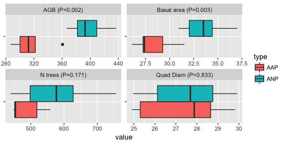
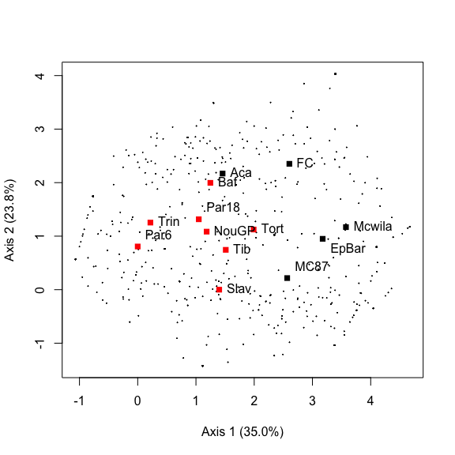
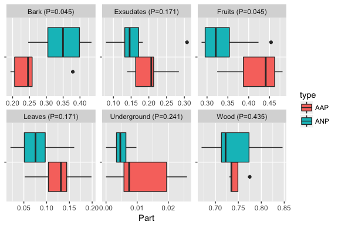
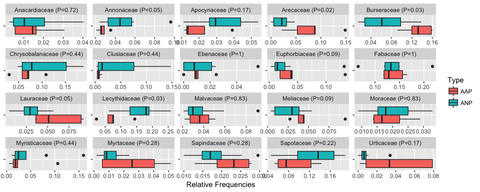

Please leave this place as clean as you found it... Long term influence of early human occupations on tree assemblages in interfluvial French Guianese forests
================
to be decided together
01/16/2018

-   [Introduction](#introduction)
-   [Materials and Methods](#materials-and-methods)
    -   [Sampled forests](#sampled-forests)
    -   [Archaeological diagnosis](#archaeological-diagnosis)
        -   [Prospection](#prospection)
        -   [Dating](#dating)
    -   [Effect of past-anthropization on tree assemblages](#effect-of-past-anthropization-on-tree-assemblages)
        -   [Forest Structure](#forest-structure)
        -   [Forest Composition](#forest-composition)
        -   [Forest Diversity](#forest-diversity)
    -   [Ethnobotanical Analysis](#ethnobotanical-analysis)
        -   [Data Compilation](#data-compilation)
        -   [Traditional uses](#traditional-uses)
        -   [Plant parts](#plant-parts)
        -   [Statistical Analyses](#statistical-analyses)
-   [Results](#results)
    -   [Effects of past-anthropization on tree assemblages](#effects-of-past-anthropization-on-tree-assemblages)
        -   [Forest Structure](#forest-structure-1)
        -   [Forest Composition](#forest-composition-1)
        -   [Forest Diversity](#forest-diversity-1)
    -   [Ethnobotanical Analysis](#ethnobotanical-analysis-1)
        -   [Traditional uses](#traditional-uses-1)
        -   [Plant parts](#plant-parts-1)
        -   [Use values and spatial diversity](#use-values-and-spatial-diversity)
-   [Supplementary materials](#supplementary-materials)
    -   [Effects on anthropization on Botanical Families](#effects-on-anthropization-on-botanical-families)
    -   [Indicator Species in anthropized AAP plots](#indicator-species-in-anthropized-aap-plots)
    -   [Effects on anthropization on Forest diversity](#effects-on-anthropization-on-forest-diversity)

``` r
knitr::opts_chunk$set(echo = TRUE)
```

Introduction
============

A growing body of archaeological and pedological evidence, accumulated since the 1990s, suggests that Amazonian Rain forests might have been much more densely occupied and intensely modified by Amerindian societies before the First Contact than previously thought (Clement et al., 2015; Heckenberger et al., 2003, 2008). These discoveries, by challenging the common idea of "pristine" tropical forests, have forced ecologists to consider precolumbian human activities as one of the potential drivers influencing biodiversity and species composition of Amazonian rainforests. In western and southern Amazonia, recent studies in historical ecology have highlighted the importance of human activities in the composition and structure of modern forests (for review see Malhi et al. (2014)). This impact was first perceptible in the nature and structure of soils (Arroyo-Kalin, 2010; Schmidt, 2010; Schmidt and Heckenberger, 2009) with Anthropogenic Dark Earths (ADE), *i.e.* black, C-, P- and N-enriched, anthropogenic soils called Terra preta do Indio in Brazil. Floristic composition has also been directly impacted (Heckenberger et al., 2007; Levis et al., 2012, 2017) with the possible dissemination of many wild species, such as *Bertholletia excelsa*, the Brazil nut tree, (Shepard Jr and Ramirez, 2011) and many palms, as well as domesticated crop plants (Balée, 2013; McMichael et al., 2015; Piperno et al., 2015). Lastly, Amazonian landscapes, between forests and savannas, also generally reflect the presence of humans with large earthworks detectable from the sky such as geoglyphs (Schaan, 2011; Stahl, 2015; Watling et al., 2017a), residential mounds and causeways (Erickson, 2000) and cities (Heckenberger et al., 2008). These impacts have mainly been shown for the alluvial plains of the Xingu, the Madeira, and Acre state, but traces of human activity are nonetheless numerous in the Guiana shield area, differing from southern Amazonia by its climate, substrate, and biogeographical history. Archeological artefacts are frequent from the coastal area to the southern border with Brazil and anthropogenic landscapes are present. On the coastal plain's savannas, raised fields are amongst the most amazing structures seen in tropical ecosystems (Rostain, 2008, 2010, 2012). They originate from abandoned Amerindian fields and subsequently engendered self-organizing processes driven by ecosystem engineers (ants, termites, earthworms, and woody plants) that have preserved the physical vestiges of these fields up to the present day (McKey et al., 2010). Further south, in the forest-covered part of the Guiana Shield, hills topped by ring-ditches or simply crossed by anthropogenic ditches (Mestre et al., 2008; 2013) can be observed. These structures testify to the major earthworks made by pre-Columbian Amerindians; many sites exceed several hectares in area. Few data exist about these sites in the Guiana Shield, but a sort of parallel can be made with the "geoglyphs" observed in the Brazilian state of Acre (Saunaluoma and Schaan, 2012; Watling et al., 2017a). One of the major ecological difference is the fact that most French Guianese earthworks are still covered by dense and so-called "mature" forests, while Acre structures were observed after deforestation. As highlighted by the recent papers by Levis et al. (2012, 2017) and Watling et al. (2017a), the influence of pre-Columbian occupation on interfluvial forest composition and diversity is hotly debated in southern and western Amazonia (Piperno et al., 2017; Watling et al., 2017b), tipping in favor of an enrichment of useful species by previous occupants (Junqueira et al., 2011). The results obtained by Levis et al. (2017) are nevertheless to be relativized. By focusing only on some edible domesticated species that are widely consumed throughout Amazonia, this study ignores non-domesticated species and those that are consumed in certain regions only. Secondly, past human influences must have been much more diverse than just the favoring of edibles trees. Over generations, the falling of trees to build houses or using wood or bark for crafts and medicine might have depleted the surrounding populations of the species so used. The sparsity of archaeological data available for the interior of the Guiana shield might also lead to a misunderstanding of the regional situation. This article aims to give new insights into the archaeological context of interfluvial terra firme forests of the Guiana Shield, and to help decipher the subtle traces of pre-Columbian influences on present day forests. Moreover, the unique context in French Guiana of massive earthworks and "preserved" contemporary forests might be a perfect combination to improve our understanding of long-term human-forest interactions in Amazonia. Hypothesizing that French Guianese earthworks have probably been subject to long-term occupation, either ceremonial, housing or public gathering, the vegetation growing on them should have been impacted by a variety of uses. Comparing these anthropized areas to areas with no evidence of past human presence in order to test Levis et al. (2017) hypothesis is a preliminary step. In a second step, we interpret the differences observed assuming that different uses of biodiversity, such as consumption of fruit gathered from the wild and prepared at a residential site, peeling off bark for medicinal purposes, or felling of trees to make house-posts, had contrasted impacts on the surrounding vegetation. To reach this objective, a nearly exhaustive historical compilation of ethnobotanical uses in the region was amassed. It concerns five of the Guianese Amerindian groups belonging to the three linguistic families represented today in the area: Karib, Arawak and Tupi-Guarani.

Materials and Methods
=====================

Sampled forests
---------------

This study involved 13 permanent plots, including 12 from the Guyafor network (Grau et al. 2017) distributed throughout the northern two-thirds of French Guiana (Figure 1). All individual trees (≥ 10 cm in diameter at breast height) present in the plots were marked, mapped, measured and botanically identified. The total dataset included 8995 trees. Individuals not determined to the genus level represent 4.02 % of all individuals.

``` r
library(knitr)
data<-read.csv2("data_v2.csv")
# data selection
data<-data[!data$Libelle=="Cplo",]
data<-data[!data$Libelle=="Lau",]
data<-data[!data$Libelle=="Tres",]
#sel<-data[(data$Libelle=="NouPP"),]
#sel<-sel[(sel$NumCarre=="204"),]
data<-data[!(data$Libelle=="NouPP"),]
#data<-rbind(data,sel)
sel<-data[(data$NomForet=="Montagne Tortue"),]
sel<-sel[!is.na(sel$X),]
sel<-sel[(sel$X<=100 & sel$Y<=100),]
data<-data[!(data$Libelle=="Tort"),]
data<-rbind(data,sel)
sel<-data[(data$NomForet=="Trinit_"),]
sel<-sel[(sel$NumCarre=="1"),]
data<-data[!(data$Libelle=="Trin"),]
data<-rbind(data,sel)
sel<-data[(data$Libelle=="EpBar"),]
sel<-sel[!is.na(sel$X),]
sel<-sel[sel$Y>100,]
data<-data[!(data$Libelle=="EpBar"),]
data<-rbind(data,sel)
data$Libelle<-as.factor(as.character(data$Libelle))
tab<-data.frame("Plot_Name"=names(table(data$Libelle)), 
                "N_trees"=as.numeric(table(data$Libelle)),
                "N_family"=as.numeric(summary(tapply(data$Famille,data$Libelle,unique))[,1]),
                "N_genera"=as.numeric(summary(tapply(data$Genre,data$Libelle,unique))[,1]),
                "N_species"=as.numeric(summary(tapply(data$idTaxon,data$Libelle,unique))[,1]),
                "Perc_Determination"=round(100-as.numeric(table(data[data$Espece=="Indet.",]$Libelle)/table(data$Libelle)*100),2),
                "Plot_Area"=c(1,1, 0.80, 9, 1.83, "NA",1,1,1.56,1,1,1,1),
                "Type"=c("AAP","ANP","AAP","AAP","AAP","AAP","ANP","ANP","ANP","ANP","ANP","ANP","ANP"))
tab[tab$Plot_Name=="Mcwila",]$N_species=length(unique(paste(data[data$Libelle=="Mcwila",]$Genre,data[data$Libelle=="Mcwila",]$Espece)))
tab$Plot_Area<-as.numeric(as.character(tab$Plot_Area))
```

    ## Warning: NAs introduced by coercion

``` r
tab[tab$Plot_Name=="Mcwila",]$Plot_Area=max(data[data$Libelle=="Mcwila",]$X)*max(data[data$Libelle=="Mcwila",]$Y)/10000
kable(tab)
```

| Plot\_Name |  N\_trees|  N\_family|  N\_genera|  N\_species|  Perc\_Determination|  Plot\_Area| Type |
|:-----------|---------:|----------:|----------:|-----------:|--------------------:|-----------:|:-----|
| Aca        |       454|         42|         93|         148|                95.59|      1.0000| AAP  |
| Baf        |       756|         39|        106|         183|                93.65|      1.0000| ANP  |
| EpBar      |       425|         39|         99|         164|                83.76|      0.8000| AAP  |
| FC         |       766|         44|        113|         225|                98.04|      9.0000| AAP  |
| MC87       |       824|         44|        126|         276|                89.56|      1.8300| AAP  |
| Mcwila     |       654|         41|        103|         173|                98.32|      1.1704| AAP  |
| NouGP      |       536|         43|        104|         169|                89.37|      1.0000| ANP  |
| Par18      |       499|         42|        103|         158|                96.39|      1.0000| ANP  |
| Par6       |       964|         41|        106|         189|                94.19|      1.5600| ANP  |
| Slav       |       620|         44|        106|         200|                88.23|      1.0000| ANP  |
| Tib        |       440|         41|        114|         176|                95.00|      1.0000| ANP  |
| Tort       |       496|         46|        122|         193|                94.15|      1.0000| ANP  |
| Trin       |       650|         40|        112|         187|                98.92|      1.0000| ANP  |

*Description of the Sampled Plots*

Archaeological diagnosis
------------------------

### Prospection

The surface of each plot was diagnosed by archaeologists. Evidence for pre-Columbian human occupations (such as artifacts, dark soils, earthworks) was searched for in the field, by superficial prospection of the ground surface while walking and carefully examining soils expelled from burrows and mounds resulting from uprooted trees. Exploratory, localized pits were also dug to confirm surface observations and to establish archaeological sequences. This allowed classifying plots as either “Apparently Anthropized Plot” (AAP) or “Apparently Non-anthropized Plot” (ANP).

### Dating

Dating was performed by AMS by the Radiocarbon Laboratory (A. Mickiewicz University, Poznań, Poland) following their routine protocol. Briefly, samples of charcoal dug from pits (after mechanical removal of macroscopic contamination visible under a binocular microscope) were treated with 1M HCl (80°C, 20+ min), 0.025-0.2M NaOH and then 0.25M HCl (80°C, 1 hour). After treatment with each reagent, the samples were rinsed with deionized water (Millipore) until pH = 7. Content of 14C in samples of carbon was measured using the spectrometer "Compact Carbon AMS" (National Electrostatics Corporation, USA) as described by Goslar et al. (2004). The measurement was performed by comparing intensities of ionic beams of 14C, 13C and 12C measured for each sample and for standard samples (modern standard: “Oxalic Acid II” and standard of 14C-free carbon: “background”). In each AMS run, 30-33 samples of unknown age were measured, alternating with measurements of 3-4 samples of modern standard and 1-2 samples of background (coal). Conventional 14C age was calculated using correction for isotopic fractionation according to Stuiver and Polach (1977), based on the ratio of 13C/12C measured in the AMS spectrometer simultaneously with the ratio 14C/12C. Calibration of 14C age was performed using the program OxCal ver. 3.10 (Bronk Ramsey, 2001, 2005). Calibration was performed against the 14C calibration curve IntCal04 (Reimer, 2004).

Effect of past-anthropization on tree assemblages
-------------------------------------------------

### Forest Structure

### Forest Composition

The differences in floristic composition among plots were compared with a Detrended Correspondence Factor Analysis (DCA), using the “decorana” function (Hill and Gauch, 1980; Oksanen and Minchin, 1997) of the “vegan” package (Oksanen et al., 2015) available on R.

#### Botanical Families

The distribution and the relative abundance of the 20 families that accounted for most individuals in the plots were submitted to a Wilcoxon-Mann-Whitney test to determine the significance of differences for each family in distribution between AAP and ANP plots.

#### Indicator Species

Indicator species are species whose abundance was found in this study to be correlated with Pre-Columbian occupation. This correlation can be either direct (managed species) or indirect (consequence of a specific pattern of recolonization after occupation), and positive (species for which human occupation is favorable) or negative (species for which past human occupation is detrimental). We used the Dufrene and Legendre (1997) methodology with the package indicspecies (De Cáceres et al.,2012).

### Forest Diversity

Diversity profiles were drawn for each plot using the “entropart” package (Marcon and Hérault, 2014) available in R. Differences between AAP and ANP plots were tested using Wilcoxon-Mann-Whitney test for the 3 main used orders of diversity (richness, Shannon index, Simpson index).

Ethnobotanical Analysis
-----------------------

### Data Compilation

Databases were created taking into account information of the 457 species present in all plots. Species represented by only one or two individuals were excluded, considering that rare species are less known and therefore more likely to be misidentified. These represented 6.6 % of all individuals (538/8104 individuals) and 46.6 % of the species (419/899 species). Botanical data were updated and standardized according to APGIII classification (Boyle et al., 2013; Bremer et al., 2009).

#### Data collection from contemporary surveys

Due to the absence of an existing pre-Columbian database on the uses of plants in forests from the Guiana shield, a compilation of contemporary ethnobotanical surveys was conducted. Although contemporary uses probably differ in some ways from past uses, the compilation of available information for present-day Amerindian groups (Palikur, Arawak, Wayãpi, Teko, and Kali’na) belonging to the three linguistic families in French Guiana (respectively Arawak, Tupi-Guarani and Karib) was thought to be the best proxy for potential pre-Columbian uses.

The choice of the datasets to be compiled was driven by three selection criteria: 1) geographical coherence (inclusion of the main cultural groups of the Guiana shield and their knowledge of tree species in the region), 2) completeness (high number of taxa recorded) and 3) quality (reliable methodologies). Most of the information is comprised of unpublished data from previous work, with the exception of those available for the Arawak and Kali’na ethnic groups (details below).

#### Data collection from interviews

All the ethnobotanical data were obtained before adoption of the ABS laws in French Guiana, and no written informed consent document was signed between traditional authorities and the researchers, except for the Teko with whom a document was signed between the Chief and the concerned investigators in July 2013. The other works were concluded under the verbal agreement of authorities during long years of continuous fieldwork. The data were nevertheless anonymized in the supplementary material in order to prevent the inappropriate reutilization of traditional knowledge traditional knowledge from undue reutilization.

Palikur and Arawak-Lokono belong to the Arawak linguistic family, Wayãpi and Teko to the Tupi-Guarani linguistic family and Kali'na to the Karib linguistic family. These three families are amongst the most important of those spoken in the Eastern Amazonian lowlands. People of the five Amerindian following groups now occupy different ecosystems, ranging from estuaries and coastal savannahs to *terra firme* forests.

-   Palikur ethnobotanical data were obtained from P. Grenand and colleagues (cf. acknowledgements), accumulated during 30 years of research with key knowledge holders of Palikur communities of French Guiana. The knowledge was recorded through completer.

-   Wayãpi ethnobotanical data were obtained from P. Grenand, and were collected over 40 years of research with key knowledge holders of Wayãpi communities of French Guiana. The knowledge was recorded through completer.

-   Kali’na ethnobotanical data were compiled by P. Grenand, C. Moretti and M. Fleury, integrating bibliographic data (Ahlbrinck, 1956; Aublet, 1775; Kloos, 1971; ONF, 2004; van Andel, 2000) and field data (ethnobotanical studies conducted between 2006 and 2008). The field data was recorded through completer.

-   Teko ethnobotanical data were collected by G. Odonne, D. Davy and M. Bruno. The knowledge was recorded through ethnobotanical walks (Prance et al., 1987) and through repeated passages in the 1 ha plots with seven informants.

-   Arawak ethnobotanical data were obtained from van Andel’s study with Arawak populations in northwestern Guyana (van Andel, 2000). The knowledge was recorded through repeated passages in seven plots of one hectare and through ethnobotanical walks.

### Traditional uses

Traditional use categories were compiled following previous studies (Balée, 1994; Chazdon and Coe, 1999; Grenand, 1992; Prance et al., 1987): “construction”, “firewood”, “human food”, “medicine and magic”, and “arts and crafts”. A species can enter from 0 to 5 categories. The “construction” category includes species used for posts and other structural elements of buildings. Species of large diameter (&gt; 50cm diameter at breast height) used now as timber in French Guiana and requiring the use of a chainsaw, were removed. Without metal, these species were not used or significantly less used by pre-Columbian populations than in the present day. Species used split or requiring no mechanical process for preparation of their wood (round wood) were retained for analysis. Then, “firewood” category was intentionally kept apart from construction woods as contemporary Amerindians often collected firewood dry, leading to a distinct pattern of collecting. The “human food” category encompasses main and secondary foods, as well as plants used for seasoning, excluding plants used as fishing/hunting baits. The “medicinal and magic” category includes medicinal plants, poisons, body dyes, plants used for hygiene. The category “arts and crafts” includes plants used to make musical instruments, weapons, games, tools, paddles, pirogues, and artisanal dyes.

### Plant parts

The second system of classification used is that of the “plant parts” categories, as the use categories are not necessarily the best proxy to determine the impacts of traditional uses on the resource (felling of a tree to make a house has evident consequences, but taking a piece of bark from a tree for medicine might provoke a defensive reaction enhancing the tree’s probability of survival). We judged that making categories of both uses and parts at the same time would split the dataset into too many subtle categories. Plant parts categories we retained are: “bark”, “wood and stems”, “seeds and fruits”, “leaves and flowers”, “exudates”, and “underground organs”.

### Statistical Analyses

Synthetic use values were established separately for traditional uses and for plant parts, in a binary way, based on the assumption that while contemporary uses may reflect past uses, the frequency of contemporary use does not necessarily reflect the frequency of pre-Columbian use. Each species cited at least once for a given contemporary use was thus given a use value of 1 for the corresponding category (traditional uses or plant parts), regardless of how many present day groups use it. The major advantage of the non-quantitative approach is to avoid the bias induced by the variable presence of a species in the territories of different ethnic groups within the region, and the probable methodological differences among the ethnobotanical studies, leading to imbalances between cultural groups. To compare the distribution of use values between AAP and ANP plots, Wilcoxon-Mann-Whitney tests were used.

#### Testing local assemblages

*to be done by Maxime Burst*

Results
=======

*The archeological diagnosis part, as currently written, should be moved to supplementary materials*

Effects of past-anthropization on tree assemblages
--------------------------------------------------

### Forest Structure

``` r
library(BIOMASS)
library(ggplot2)
dataTaxo<-unique(data.frame(genus=data$Genre,species=data$Espece))
#dataTaxoC<-correctTaxo(dataTaxo$genus,dataTaxo$species)
#save(dataTaxoC,file="taxo.RData")
#table(dataTaxoC$nameModified)
load(file="taxo.RData")
data$wd<-getWoodDensity(data$Genre,data$Espece, stand=data$Libelle)$meanWD
```

    ## The reference dataset contains 16467 wood density values 
    ## Your taxonomic table contains 979 taxa

``` r
data$height<-1/(1/40.53+1/(1.89*data$Circonference/pi))         # Molto Equation
data$agb<-computeAGB(D=data$Circonference/pi,WD=data$wd, H=data$height)
tab$Plot_Area<-as.numeric(as.character(tab$Plot_Area))
tab$agb<-as.numeric(tapply(data$agb,data$Libelle,sum))/tab$Plot_Area
tab$N<-tab$N_trees/tab$Plot_Area
tab$Dg<-as.numeric(tapply(data$Circonference/pi,data$Libelle,function(x) {sqrt(mean(x^2))}))
tab$ba<-as.numeric(tapply(data$Circonference/pi/2,data$Libelle,function(x) {sum(pi*(x/100)^2)}))/tab$Plot_Area
data_str<-data.frame(var=c(rep("AGB",13),rep("N trees",13),rep("Quad Diam",13), rep("Basal area",13)),value=c(tab$agb,tab$N,tab$Dg,tab$ba),type=rep(tab$Type,4))
data_str<-na.omit(data_str)
var<-levels(data_str$var)
data_str$var<-as.character(data_str$var)
for (i in var){
test<-round(wilcox.test(data_str[data_str$var==i & data_str$type=="AAP",]$value,
            data_str[data_str$var==i & data_str$type=="ANP",]$value)$p.value,3)
data_str[data_str$var== i,]$var<-paste(i," (P=", test, ")", sep="")}
p <- ggplot(data = data_str, aes(x=var, y=value)) + 
  geom_boxplot(aes(fill=type)) +
  theme(axis.text.y=element_blank(), axis.title.y=element_blank())+
  coord_flip()
p + facet_wrap( ~ var, scales="free")
```



### Forest Composition

#### Neutral composition

AAPs and ANPs plots are well separated along the 1st axis of the DCA (figure 2). AAP sites were grouped towards the right side of the axis 1 that represents 35% of the observed variation in species composition. Past human occupation is thus the main source of differences in species composition among our sampled plots.

``` r
library(vegan)
data<-data[!data$Espece=="Indet.",]
data<-data[!is.na(data$Genre),]
data$species<-paste(data$Genre,data$Espece, sep=" ")
data_dca<-t(table(data$species,data$Libelle))
dca<-decorana(data_dca)
plot(dca$cproj[,1:2], cex=0.1, xlab="Axis 1 (35.0%)", ylab="Axis 2 (23.8%)")
points(dca$rproj[,1:2], col=tab$Type, pch=15, cex=1)
x<-round(as.numeric(dca$rproj[,1]),2)
y<-round(as.numeric(dca$rproj[,2]),2)
y[9]<-y[9]+0.2
y[8]<-y[8]+0.2
y[3]<-y[3]-0.2
y[5]<-y[5]+0.2
text(x, y, tab$Plot_Name, pos=4)
```



*Detrended Correspondance Analysis performed on the tree composition dataset. Small dots are species. Large dots are sampled sites, either AAPs (black) or ANPs (red).*

#### Functional composition

``` r
library(ggplot2)
traits<-read.csv2("TraitsAll.csv")
data_traits<-merge(data,traits, by.x="species", by.y="Taxon", all.x=F, all.y=F)
tab$WD<-as.numeric(tapply(data_traits$wd,data_traits$Libelle,mean))
tab$SLA<-as.numeric(tapply(data_traits$SLA,data_traits$Libelle,mean, na.rm=T))
tab$Seed<-as.numeric(tapply(data_traits$Seed,data_traits$Libelle,mean, na.rm=T))
tab$Height<-as.numeric(tapply(data_traits$Height,data_traits$Libelle,mean, na.rm=T))
data_trait<-data.frame(var=c(rep("Wood Density",13),rep("Specific Leaf Area",13),rep("Seed Mass",13), rep("Height",13)),Trait_Value=c(tab$WD,tab$SLA,tab$Seed,tab$Height),type=rep(tab$Type,4))
var<-levels(as.factor(data_trait$var))
data_trait$var<-as.character(data_trait$var)
for (i in var){
test<-round(wilcox.test(data_trait[data_trait$var==i & data_trait$type=="AAP",]$Trait_Value,
             data_trait[data_trait$var==i & data_trait$type=="ANP",]$Trait_Value)$p.value,3)
 data_trait[data_trait$var== i,]$var<-paste(i," (P=", test, ")", sep="")}
p <- ggplot(data = data_trait, aes(x=var, y=Trait_Value)) + 
   geom_boxplot(aes(fill=type)) +
   theme(axis.text.y=element_blank(), axis.title.y=element_blank())+
   coord_flip()
 p + facet_wrap( ~ var, scales="free")
```


*Comparison of the average trait values between AAP and ANP plots*

### Forest Diversity

Alpha diversities were assessed for each plot through their neutral and functional diversity profiles that allow to tract the relative importance of rare species in shaping the the plot ranking. Generally, all plots (AAPs and ANPs) share a similar decreasing pattern of diversity. Nevertheless, for q = 0 (species richness),the anthropized plots AAP tend to have higher neutral diversity (Wilcoxon tests, P=0.12) but the weak signal disappears with increasing q (P=0.43 for q=1, P=0.72 for q=2). Nothing was detected for functional diversity (see Supp Mat .

Ethnobotanical Analysis
-----------------------

*to be eventually updated* Among the different species, 47.7 % (218/457) are used for crafts, 32.8 % (150/457) as building material, 27.8 % (127/457) for medicinal/magical use, 27.6 % (126/457) are used as firewood and 26.7 % (122) produce plant parts edible for humans. Considering the parts used, the most frequent use is of the wood (58.9 %; 269/457). Seeds and/or fruits are used for 58.9 % (140/457), bark for 25.2 % (115/457), exudates for 10.3 % (47/457), leaves and/or flowers for 6.8 % (31/457) and roots or other underground parts for 0.9 % (4/457).

### Traditional uses

Use categories of the trees in each plot were submitted to an ANOVA (one factor, lm function in R) in order to detect relationships between uses and species composition of plot. The different trends are shown in figure 6. Plants used as human food were significantly more often present (p &lt; 0.02) in AAPs than in ANPs. This trend was also observed for species used as firewood, although it was less evident (p &lt; 0.09). No conclusion can be drawn for species in the “medicine and magic” and “arts and crafts” categories owing to their high p values. Lastly, species used in construction tended to be more often present (p &lt; 0.09) in non-anthropogenic plots (ANPs) than in AAPs. These trends are important result of our study, corroborating the results of section 3.2 (figure 2). Presence of human occupation seems to be detectable up to 600 or even 1000 years after the presumed occupation, and biocultural interactions are probably important factors explaining present-day forest composition.

``` r
library(ggplot2)
uses<-read.csv2("uses.csv")
uses_t<-data.frame(species=uses$X...genre_espece, Crafts=uses$Artisanat, Construction=uses$Construction, Firewood=uses$Feu, Food=uses$Alimentation, Medicine=uses$M..d.Mag)
data_uses<-merge(data,uses_t, by.x="species", by.y="species", all.x=F, all.y=F)
data_uses[data_uses$Crafts>0,]$Crafts<-1
data_uses[data_uses$Construction>0,]$Construction<-1
data_uses[data_uses$Firewood>0,]$Firewood<-1
data_uses[data_uses$Food>0,]$Food<-1
data_uses[data_uses$Medicine>0,]$Medicine<-1
tab$Crafts<-as.numeric(tapply(data_uses$Crafts,data_uses$Libelle,sum))/
  as.numeric(tapply(data_uses$Crafts,data_uses$Libelle,length))
tab$Construction<-as.numeric(tapply(data_uses$Construction,data_uses$Libelle,sum))/
  as.numeric(tapply(data_uses$Construction,data_uses$Libelle,length))
tab$Firewood<-as.numeric(tapply(data_uses$Firewood,data_uses$Libelle,sum))/
  as.numeric(tapply(data_uses$Firewood,data_uses$Libelle,length))
tab$Food<-as.numeric(tapply(data_uses$Food,data_uses$Libelle,sum))/
  as.numeric(tapply(data_uses$Food,data_uses$Libelle,length))
tab$Medicine<-as.numeric(tapply(data_uses$Medicine,data_uses$Libelle,sum))/
  as.numeric(tapply(data_uses$Medicine,data_uses$Libelle,length))
data_use<-data.frame(var=c(rep("Crafts",13),rep("Construction",13),rep("Firewood",13), rep("Food",13), rep("Medicine",13)),Use_Value=c(tab$Crafts,tab$Construction,tab$Firewood,tab$Food, tab$Medicine),type=rep(tab$Type,5))
var<-levels(data_use$var)
data_use$var<-as.character(data_use$var)
for (i in var){
test<-round(wilcox.test(data_use[data_use$var==i & data_use$type=="AAP",]$Use_Value,
             data_use[data_use$var==i & data_use$type=="ANP",]$Use_Value)$p.value,3)
 data_use[data_use$var== i,]$var<-paste(i," (P=", test, ")", sep="")}
p <- ggplot(data = data_use, aes(x=var, y=Use_Value)) + 
   geom_boxplot(aes(fill=type)) +
   theme(axis.text.y=element_blank(), axis.title.y=element_blank())+
   coord_flip()
 p + facet_wrap( ~ var, scales="free")
```


### Plant parts

As for section 3.3.2, an ANOVA was performed in order to detect relationships between the parts potentially used for each plant and species composition of plots. The trends observed are shown in figure 7. Plants with useful seeds and fruits (p &lt; 0.02), leaves and flowers (p &lt; 0.03), underground organs (p &lt; 0.12) and exudates (p &lt; 0.17) were, at diverse scales, more often present on AAPs than on ANPs. The most striking difference concerned species with useful seeds and fruits. Conversely, an increase in the abundance of plants used for their bark (p &lt; 0.06) and to a lesser extent of those used for their wood and stems (p &lt; 0.29) was observed for the ANPs. The different patterns observed appear to support the hypothesis that pre-Columbian humans had a long-term influence on present day patterns of biodiversity.

``` r
library(ggplot2)
parts_t<-data.frame(species=uses$X...genre_espece, Bark=uses$Ecorces, Exsudates= uses$Exsudats, Fruits=uses$Graines_Fruits, Leaves=uses$Feuilles_Fleurs, Underground=uses$Org.St, Wood=uses$Bois_Tiges)
data_parts<-merge(data,parts_t, by.x="species", by.y="species", all.x=F, all.y=F)
data_parts[data_parts$Bark>0,]$Bark<-1
data_parts[data_parts$Exsudates>0,]$Exsudates<-1
data_parts[data_parts$Fruits>0,]$Fruits<-1
data_parts[data_parts$Leaves>0,]$Leaves<-1
data_parts[data_parts$Underground>0,]$Underground<-1
data_parts[data_parts$Wood>0,]$Wood<-1
tab$Bark<-as.numeric(tapply(data_parts$Bark,data_parts$Libelle,sum))/
  as.numeric(tapply(data_parts$Bark,data_parts$Libelle,length))
tab$Exsudates<-as.numeric(tapply(data_parts$Exsudates,data_parts$Libelle,sum))/
  as.numeric(tapply(data_parts$Exsudates,data_parts$Libelle,length))
tab$Fruits<-as.numeric(tapply(data_parts$Fruits,data_parts$Libelle,sum))/
  as.numeric(tapply(data_parts$Fruits,data_parts$Libelle,length))
tab$Leaves<-as.numeric(tapply(data_parts$Leaves,data_parts$Libelle,sum))/
  as.numeric(tapply(data_parts$Leaves,data_parts$Libelle,length))
tab$Underground<-as.numeric(tapply(data_parts$Underground,data_parts$Libelle,sum))/
  as.numeric(tapply(data_parts$Underground,data_parts$Libelle,length))
tab$Wood<-as.numeric(tapply(data_parts$Wood,data_parts$Libelle,sum))/
  as.numeric(tapply(data_parts$Wood,data_parts$Libelle,length))
data_part<-data.frame(var=c(rep("Bark",13),rep("Exsudates",13),rep("Fruits",13), rep("Leaves",13), rep("Underground",13), rep("Wood",13)),Part=c(tab$Bark,tab$Exsudates,tab$Fruits,tab$Leaves, tab$Underground, tab$Wood),type=rep(tab$Type,6))
var<-levels(data_part$var)
data_part$var<-as.character(data_part$var)
for (i in var){
test<-round(wilcox.test(data_part[data_part$var==i & data_part$type=="AAP",]$Part,
             data_part[data_part$var==i & data_part$type=="ANP",]$Part)$p.value,3)
 data_part[data_part$var== i,]$var<-paste(i," (P=", test, ")", sep="")}
p <- ggplot(data = data_part, aes(x=var, y=Part)) + 
   geom_boxplot(aes(fill=type)) +
   theme(axis.text.y=element_blank(), axis.title.y=element_blank())+
   coord_flip()
 p + facet_wrap( ~ var, scales="free")
```



### Use values and spatial diversity

As for section 3.3.2, an ANOVA was performed in order to detect relationships between the parts potentially used for each plant and species composition of plots. The trends observed are shown in figure 7. Plants with useful seeds and fruits (p &lt; 0.02), leaves and flowers (p &lt; 0.03), underground organs (p &lt; 0.12) and exudates (p &lt; 0.17) were, at diverse scales, more often present on AAPs than on ANPs. The most striking difference concerned species with useful seeds and fruits. Conversely, an increase in the abundance of plants used for their bark (p &lt; 0.06) and to a lesser extent of those used for their wood and stems (p &lt; 0.29) was observed for the ANPs. The different patterns observed appear to support the hypothesis that pre-Columbian humans had a long-term influence on present day patterns of biodiversity.

``` r
data_spat<-data_uses[!data_uses$Libelle %in% "FC",]
Nind<-30
data_spat$richness<-999
data_spat$Ncrafts<-999
data_spat$Nconstruction<-999
data_spat$Nfirewood<-999
data_spat$Nfood<-999
data_spat$Nmedicine<-999
data_spat$Libelle<-as.factor(as.character(data_spat$Libelle))
for (j in levels(data_spat$Libelle))
  {test<-data_spat[data_spat$Libelle == j,]
  sp<-numeric()
  Ncrafts<-numeric()
  Nconstruction<-numeric()
  Nfirewood<-numeric()
  Nfood<-numeric()
  Nmedicine<-numeric()
    for (i in 1:dim(test)[1]){
    sp[i]<-dim(table(test[rank(as.matrix(dist(x=cbind(test$X,test$Y), diag = F))[i,]) %in% 2:(Nind+1),]$species))
    Ncrafts[i]<-sum(test[rank(as.matrix(dist(x=cbind(test$X,test$Y), diag = F))[i,]) %in% 2:(Nind+1),]$Crafts >0)
    Nconstruction[i]<-sum(test[rank(as.matrix(dist(x=cbind(test$X,test$Y), diag = F))[i,]) %in% 2:(Nind+1),]$Construction >0)
    Nfirewood[i]<-sum(test[rank(as.matrix(dist(x=cbind(test$X,test$Y), diag = F))[i,]) %in% 2:(Nind+1),]$Firewood >0)
    Nfood[i]<-sum(test[rank(as.matrix(dist(x=cbind(test$X,test$Y), diag = F))[i,]) %in% 2:(Nind+1),]$Food >0)
    Nmedicine[i]<-sum(test[rank(as.matrix(dist(x=cbind(test$X,test$Y), diag = F))[i,]) %in% 2:(Nind+1),]$Medicine >0)
    }
  data_spat[data_spat$Libelle==j,]$richness<-sp
  data_spat[data_spat$Libelle==j,]$Ncrafts<-Ncrafts
  data_spat[data_spat$Libelle==j,]$Nconstruction<-Nconstruction
  data_spat[data_spat$Libelle==j,]$Nfirewood<-Nfirewood
  data_spat[data_spat$Libelle==j,]$Nfood<-Nfood
  data_spat[data_spat$Libelle==j,]$Nmedicine<-Nmedicine
  sp<-NULL
  print(j)
}
```

    ## [1] "Aca"
    ## [1] "Baf"
    ## [1] "EpBar"
    ## [1] "MC87"
    ## [1] "Mcwila"
    ## [1] "NouGP"
    ## [1] "Par18"
    ## [1] "Par6"
    ## [1] "Slav"
    ## [1] "Tib"
    ## [1] "Tort"
    ## [1] "Trin"

``` r
data_spat$type<-"ANP"
library(ggplot2)
data_spat[data_spat$Libelle %in% c("Aca", "EpBar", "MC87", "Mcwila"),]$type<-"AAP"
ggplot(data_spat, aes(richness, Nfood, color = factor(type), 
   shape = factor(Libelle), 
   linetype = factor(Libelle)))+
  geom_point()+
  stat_smooth(method = "loess")
```


``` r
ggplot(data_spat, aes(richness, Nmedicine, color = factor(type), 
   shape = factor(Libelle), 
   linetype = factor(Libelle)))+
  geom_point()+
  stat_smooth(method = "loess")
```


``` r
ggplot(data_spat, aes(richness, Nconstruction, color = factor(type), 
   shape = factor(Libelle), 
   linetype = factor(Libelle)))+
  geom_point()+
  stat_smooth(method = "loess")
```


``` r
ggplot(data_spat, aes(richness, Nfirewood, color = factor(type), 
   shape = factor(Libelle), 
   linetype = factor(Libelle)))+
  geom_point()+
  stat_smooth(method = "loess")
```


``` r
ggplot(data_spat, aes(richness, Ncrafts, color = factor(type), 
   shape = factor(Libelle), 
   linetype = factor(Libelle)))+
  geom_point()+
  stat_smooth(method = "loess")
```


``` r
summary(glm(data_spat$Nmedicine ~ data_spat$Libelle + data_spat$richness:data_spat$type + data_spat$richness:data_spat$Libelle))
```

    ## 
    ## Call:
    ## glm(formula = data_spat$Nmedicine ~ data_spat$Libelle + data_spat$richness:data_spat$type + 
    ##     data_spat$richness:data_spat$Libelle)
    ## 
    ## Deviance Residuals: 
    ##     Min       1Q   Median       3Q      Max  
    ## -8.8017  -1.8761  -0.0606   1.8229   9.8007  
    ## 
    ## Coefficients: (1 not defined because of singularities)
    ##                                             Estimate Std. Error t value
    ## (Intercept)                                 20.61906    1.41791  14.542
    ## data_spat$LibelleBaf                        -7.50358    1.94608  -3.856
    ## data_spat$LibelleEpBar                     -15.78147    1.73938  -9.073
    ## data_spat$LibelleMC87                       -5.46069    1.72388  -3.168
    ## data_spat$LibelleMcwila                     -4.11348    1.62783  -2.527
    ## data_spat$LibelleNouGP                     -10.33900    1.77807  -5.815
    ## data_spat$LibellePar18                     -15.48369    1.74238  -8.887
    ## data_spat$LibellePar6                      -13.80605    1.55277  -8.891
    ## data_spat$LibelleSlav                      -10.69848    1.98364  -5.393
    ## data_spat$LibelleTib                       -11.55208    2.16770  -5.329
    ## data_spat$LibelleTort                      -12.65327    2.01148  -6.291
    ## data_spat$LibelleTrin                        5.11035    1.92381   2.656
    ## data_spat$richness:data_spat$typeAAP        -0.35438    0.06495  -5.457
    ## data_spat$richness:data_spat$typeANP        -0.59638    0.05665 -10.528
    ## data_spat$LibelleBaf:data_spat$richness      0.55600    0.08175   6.801
    ## data_spat$LibelleEpBar:data_spat$richness    0.63219    0.08003   7.900
    ## data_spat$LibelleMC87:data_spat$richness     0.15578    0.07770   2.005
    ## data_spat$LibelleMcwila:data_spat$richness   0.16989    0.07648   2.222
    ## data_spat$LibelleNouGP:data_spat$richness    0.68039    0.07382   9.217
    ## data_spat$LibellePar18:data_spat$richness    0.90485    0.07536  12.007
    ## data_spat$LibellePar6:data_spat$richness     0.69540    0.06643  10.469
    ## data_spat$LibelleSlav:data_spat$richness     0.68527    0.08282   8.275
    ## data_spat$LibelleTib:data_spat$richness      0.65995    0.08940   7.382
    ## data_spat$LibelleTort:data_spat$richness     0.69933    0.07925   8.825
    ## data_spat$LibelleTrin:data_spat$richness          NA         NA      NA
    ##                                            Pr(>|t|)    
    ## (Intercept)                                 < 2e-16 ***
    ## data_spat$LibelleBaf                       0.000117 ***
    ## data_spat$LibelleEpBar                      < 2e-16 ***
    ## data_spat$LibelleMC87                      0.001544 ** 
    ## data_spat$LibelleMcwila                    0.011530 *  
    ## data_spat$LibelleNouGP                     6.38e-09 ***
    ## data_spat$LibellePar18                      < 2e-16 ***
    ## data_spat$LibellePar6                       < 2e-16 ***
    ## data_spat$LibelleSlav                      7.18e-08 ***
    ## data_spat$LibelleTib                       1.02e-07 ***
    ## data_spat$LibelleTort                      3.39e-10 ***
    ## data_spat$LibelleTrin                      0.007919 ** 
    ## data_spat$richness:data_spat$typeAAP       5.05e-08 ***
    ## data_spat$richness:data_spat$typeANP        < 2e-16 ***
    ## data_spat$LibelleBaf:data_spat$richness    1.14e-11 ***
    ## data_spat$LibelleEpBar:data_spat$richness  3.30e-15 ***
    ## data_spat$LibelleMC87:data_spat$richness   0.045030 *  
    ## data_spat$LibelleMcwila:data_spat$richness 0.026354 *  
    ## data_spat$LibelleNouGP:data_spat$richness   < 2e-16 ***
    ## data_spat$LibellePar18:data_spat$richness   < 2e-16 ***
    ## data_spat$LibellePar6:data_spat$richness    < 2e-16 ***
    ## data_spat$LibelleSlav:data_spat$richness    < 2e-16 ***
    ## data_spat$LibelleTib:data_spat$richness    1.77e-13 ***
    ## data_spat$LibelleTort:data_spat$richness    < 2e-16 ***
    ## data_spat$LibelleTrin:data_spat$richness         NA    
    ## ---
    ## Signif. codes:  0 '***' 0.001 '**' 0.01 '*' 0.05 '.' 0.1 ' ' 1
    ## 
    ## (Dispersion parameter for gaussian family taken to be 7.556957)
    ## 
    ##     Null deviance: 58493  on 6073  degrees of freedom
    ## Residual deviance: 45720  on 6050  degrees of freedom
    ## AIC: 29548
    ## 
    ## Number of Fisher Scoring iterations: 2

``` r
summary(glm(data_spat$Ncrafts ~ data_spat$Libelle + data_spat$richness:data_spat$type + data_spat$richness:data_spat$Libelle-1))
```

    ## 
    ## Call:
    ## glm(formula = data_spat$Ncrafts ~ data_spat$Libelle + data_spat$richness:data_spat$type + 
    ##     data_spat$richness:data_spat$Libelle - 1)
    ## 
    ## Deviance Residuals: 
    ##      Min        1Q    Median        3Q       Max  
    ## -12.7018   -1.7398    0.0643    1.7809    9.5318  
    ## 
    ## Coefficients: (1 not defined because of singularities)
    ##                                            Estimate Std. Error t value
    ## data_spat$LibelleAca                       24.95800    1.42228  17.548
    ## data_spat$LibelleBaf                       19.05332    1.33706  14.250
    ## data_spat$LibelleEpBar                      9.88522    1.01056   9.782
    ## data_spat$LibelleMC87                      11.85758    0.98348  12.057
    ## data_spat$LibelleMcwila                    23.35458    0.80208  29.118
    ## data_spat$LibelleNouGP                     18.14694    1.07620  16.862
    ## data_spat$LibellePar18                     14.89179    1.01576  14.661
    ## data_spat$LibellePar6                      15.83190    0.63490  24.936
    ## data_spat$LibelleSlav                      25.50622    1.39149  18.330
    ## data_spat$LibelleTib                       17.07821    1.64471  10.384
    ## data_spat$LibelleTort                      21.53017    1.43114  15.044
    ## data_spat$LibelleTrin                      24.17948    1.30424  18.539
    ## data_spat$richness:data_spat$typeAAP       -0.11858    0.06515  -1.820
    ## data_spat$richness:data_spat$typeANP       -0.22388    0.05682  -3.940
    ## data_spat$LibelleBaf:data_spat$richness     0.29468    0.08200   3.594
    ## data_spat$LibelleEpBar:data_spat$richness   0.41352    0.08027   5.151
    ## data_spat$LibelleMC87:data_spat$richness    0.40534    0.07794   5.200
    ## data_spat$LibelleMcwila:data_spat$richness  0.11224    0.07671   1.463
    ## data_spat$LibelleNouGP:data_spat$richness   0.20654    0.07405   2.789
    ## data_spat$LibellePar18:data_spat$richness   0.41733    0.07559   5.521
    ## data_spat$LibellePar6:data_spat$richness    0.34076    0.06663   5.114
    ## data_spat$LibelleSlav:data_spat$richness   -0.03978    0.08307  -0.479
    ## data_spat$LibelleTib:data_spat$richness     0.23996    0.08968   2.676
    ## data_spat$LibelleTort:data_spat$richness    0.13500    0.07949   1.698
    ## data_spat$LibelleTrin:data_spat$richness         NA         NA      NA
    ##                                            Pr(>|t|)    
    ## data_spat$LibelleAca                        < 2e-16 ***
    ## data_spat$LibelleBaf                        < 2e-16 ***
    ## data_spat$LibelleEpBar                      < 2e-16 ***
    ## data_spat$LibelleMC87                       < 2e-16 ***
    ## data_spat$LibelleMcwila                     < 2e-16 ***
    ## data_spat$LibelleNouGP                      < 2e-16 ***
    ## data_spat$LibellePar18                      < 2e-16 ***
    ## data_spat$LibellePar6                       < 2e-16 ***
    ## data_spat$LibelleSlav                       < 2e-16 ***
    ## data_spat$LibelleTib                        < 2e-16 ***
    ## data_spat$LibelleTort                       < 2e-16 ***
    ## data_spat$LibelleTrin                       < 2e-16 ***
    ## data_spat$richness:data_spat$typeAAP       0.068772 .  
    ## data_spat$richness:data_spat$typeANP       8.23e-05 ***
    ## data_spat$LibelleBaf:data_spat$richness    0.000329 ***
    ## data_spat$LibelleEpBar:data_spat$richness  2.67e-07 ***
    ## data_spat$LibelleMC87:data_spat$richness   2.05e-07 ***
    ## data_spat$LibelleMcwila:data_spat$richness 0.143500    
    ## data_spat$LibelleNouGP:data_spat$richness  0.005297 ** 
    ## data_spat$LibellePar18:data_spat$richness  3.51e-08 ***
    ## data_spat$LibellePar6:data_spat$richness   3.25e-07 ***
    ## data_spat$LibelleSlav:data_spat$richness   0.632048    
    ## data_spat$LibelleTib:data_spat$richness    0.007475 ** 
    ## data_spat$LibelleTort:data_spat$richness   0.089501 .  
    ## data_spat$LibelleTrin:data_spat$richness         NA    
    ## ---
    ## Signif. codes:  0 '***' 0.001 '**' 0.01 '*' 0.05 '.' 0.1 ' ' 1
    ## 
    ## (Dispersion parameter for gaussian family taken to be 7.603628)
    ## 
    ##     Null deviance: 2326215  on 6074  degrees of freedom
    ## Residual deviance:   46002  on 6050  degrees of freedom
    ## AIC: 29585
    ## 
    ## Number of Fisher Scoring iterations: 2

``` r
summary(glm(data_spat$Nconstruction ~ data_spat$Libelle + data_spat$richness:data_spat$type + data_spat$richness:data_spat$Libelle))
```

    ## 
    ## Call:
    ## glm(formula = data_spat$Nconstruction ~ data_spat$Libelle + data_spat$richness:data_spat$type + 
    ##     data_spat$richness:data_spat$Libelle)
    ## 
    ## Deviance Residuals: 
    ##     Min       1Q   Median       3Q      Max  
    ## -10.750   -2.231   -0.024    2.208   11.010  
    ## 
    ## Coefficients: (1 not defined because of singularities)
    ##                                            Estimate Std. Error t value
    ## (Intercept)                                 3.58913    1.62169   2.213
    ## data_spat$LibelleBaf                        4.36058    2.22578   1.959
    ## data_spat$LibelleEpBar                     11.84220    1.98936   5.953
    ## data_spat$LibelleMC87                       8.05577    1.97164   4.086
    ## data_spat$LibelleMcwila                     8.29470    1.86179   4.455
    ## data_spat$LibelleNouGP                     20.22801    2.03362   9.947
    ## data_spat$LibellePar18                      5.74954    1.99280   2.885
    ## data_spat$LibellePar6                      17.68356    1.77594   9.957
    ## data_spat$LibelleSlav                      17.16458    2.26873   7.566
    ## data_spat$LibelleTib                       31.79051    2.47925  12.823
    ## data_spat$LibelleTort                       9.47399    2.30057   4.118
    ## data_spat$LibelleTrin                      19.71778    2.20031   8.961
    ## data_spat$richness:data_spat$typeAAP        0.33238    0.07428   4.475
    ## data_spat$richness:data_spat$typeANP       -0.35708    0.06479  -5.512
    ## data_spat$LibelleBaf:data_spat$richness     0.52014    0.09350   5.563
    ## data_spat$LibelleEpBar:data_spat$richness  -0.49793    0.09153  -5.440
    ## data_spat$LibelleMC87:data_spat$richness   -0.23042    0.08887  -2.593
    ## data_spat$LibelleMcwila:data_spat$richness -0.35667    0.08747  -4.078
    ## data_spat$LibelleNouGP:data_spat$richness  -0.03681    0.08443  -0.436
    ## data_spat$LibellePar18:data_spat$richness   0.51064    0.08619   5.925
    ## data_spat$LibellePar6:data_spat$richness    0.07287    0.07597   0.959
    ## data_spat$LibelleSlav:data_spat$richness    0.01975    0.09472   0.209
    ## data_spat$LibelleTib:data_spat$richness    -0.43482    0.10225  -4.252
    ## data_spat$LibelleTort:data_spat$richness    0.33442    0.09063   3.690
    ## data_spat$LibelleTrin:data_spat$richness         NA         NA      NA
    ##                                            Pr(>|t|)    
    ## (Intercept)                                0.026921 *  
    ## data_spat$LibelleBaf                       0.050144 .  
    ## data_spat$LibelleEpBar                     2.78e-09 ***
    ## data_spat$LibelleMC87                      4.45e-05 ***
    ## data_spat$LibelleMcwila                    8.53e-06 ***
    ## data_spat$LibelleNouGP                      < 2e-16 ***
    ## data_spat$LibellePar18                     0.003926 ** 
    ## data_spat$LibellePar6                       < 2e-16 ***
    ## data_spat$LibelleSlav                      4.43e-14 ***
    ## data_spat$LibelleTib                        < 2e-16 ***
    ## data_spat$LibelleTort                      3.87e-05 ***
    ## data_spat$LibelleTrin                       < 2e-16 ***
    ## data_spat$richness:data_spat$typeAAP       7.79e-06 ***
    ## data_spat$richness:data_spat$typeANP       3.70e-08 ***
    ## data_spat$LibelleBaf:data_spat$richness    2.76e-08 ***
    ## data_spat$LibelleEpBar:data_spat$richness  5.53e-08 ***
    ## data_spat$LibelleMC87:data_spat$richness   0.009545 ** 
    ## data_spat$LibelleMcwila:data_spat$richness 4.61e-05 ***
    ## data_spat$LibelleNouGP:data_spat$richness  0.662854    
    ## data_spat$LibellePar18:data_spat$richness  3.30e-09 ***
    ## data_spat$LibellePar6:data_spat$richness   0.337521    
    ## data_spat$LibelleSlav:data_spat$richness   0.834820    
    ## data_spat$LibelleTib:data_spat$richness    2.15e-05 ***
    ## data_spat$LibelleTort:data_spat$richness   0.000226 ***
    ## data_spat$LibelleTrin:data_spat$richness         NA    
    ## ---
    ## Signif. codes:  0 '***' 0.001 '**' 0.01 '*' 0.05 '.' 0.1 ' ' 1
    ## 
    ## (Dispersion parameter for gaussian family taken to be 9.88528)
    ## 
    ##     Null deviance: 84420  on 6073  degrees of freedom
    ## Residual deviance: 59806  on 6050  degrees of freedom
    ## AIC: 31179
    ## 
    ## Number of Fisher Scoring iterations: 2

``` r
summary(glm(data_spat$Nfirewood ~ data_spat$Libelle + data_spat$richness:data_spat$type + data_spat$richness:data_spat$Libelle))
```

    ## 
    ## Call:
    ## glm(formula = data_spat$Nfirewood ~ data_spat$Libelle + data_spat$richness:data_spat$type + 
    ##     data_spat$richness:data_spat$Libelle)
    ## 
    ## Deviance Residuals: 
    ##     Min       1Q   Median       3Q      Max  
    ## -9.5810  -1.7271  -0.0802   1.6665   9.4941  
    ## 
    ## Coefficients: (1 not defined because of singularities)
    ##                                             Estimate Std. Error t value
    ## (Intercept)                                 16.56096    1.30140  12.726
    ## data_spat$LibelleBaf                       -15.74859    1.78617  -8.817
    ## data_spat$LibelleEpBar                      -9.85805    1.59645  -6.175
    ## data_spat$LibelleMC87                      -14.81355    1.58223  -9.362
    ## data_spat$LibelleMcwila                     -4.13810    1.49407  -2.770
    ## data_spat$LibelleNouGP                     -20.62079    1.63197 -12.636
    ## data_spat$LibellePar18                     -10.16455    1.59921  -6.356
    ## data_spat$LibellePar6                      -12.20087    1.42518  -8.561
    ## data_spat$LibelleSlav                      -18.97152    1.82064 -10.420
    ## data_spat$LibelleTib                         4.93008    1.98958   2.478
    ## data_spat$LibelleTort                       -6.82837    1.84620  -3.699
    ## data_spat$LibelleTrin                       -2.89938    1.76573  -1.642
    ## data_spat$richness:data_spat$typeAAP        -0.21342    0.05961  -3.580
    ## data_spat$richness:data_spat$typeANP        -0.27139    0.05199  -5.220
    ## data_spat$LibelleBaf:data_spat$richness      0.61384    0.07503   8.181
    ## data_spat$LibelleEpBar:data_spat$richness    0.42960    0.07345   5.849
    ## data_spat$LibelleMC87:data_spat$richness     0.49072    0.07132   6.881
    ## data_spat$LibelleMcwila:data_spat$richness   0.16390    0.07019   2.335
    ## data_spat$LibelleNouGP:data_spat$richness    0.74612    0.06775  11.012
    ## data_spat$LibellePar18:data_spat$richness    0.45289    0.06917   6.548
    ## data_spat$LibellePar6:data_spat$richness     0.40454    0.06097   6.635
    ## data_spat$LibelleSlav:data_spat$richness     0.66367    0.07601   8.731
    ## data_spat$LibelleTib:data_spat$richness     -0.09023    0.08206  -1.100
    ## data_spat$LibelleTort:data_spat$richness     0.32322    0.07273   4.444
    ## data_spat$LibelleTrin:data_spat$richness          NA         NA      NA
    ##                                            Pr(>|t|)    
    ## (Intercept)                                 < 2e-16 ***
    ## data_spat$LibelleBaf                        < 2e-16 ***
    ## data_spat$LibelleEpBar                     7.05e-10 ***
    ## data_spat$LibelleMC87                       < 2e-16 ***
    ## data_spat$LibelleMcwila                    0.005628 ** 
    ## data_spat$LibelleNouGP                      < 2e-16 ***
    ## data_spat$LibellePar18                     2.22e-10 ***
    ## data_spat$LibellePar6                       < 2e-16 ***
    ## data_spat$LibelleSlav                       < 2e-16 ***
    ## data_spat$LibelleTib                       0.013241 *  
    ## data_spat$LibelleTort                      0.000219 ***
    ## data_spat$LibelleTrin                      0.100637    
    ## data_spat$richness:data_spat$typeAAP       0.000346 ***
    ## data_spat$richness:data_spat$typeANP       1.85e-07 ***
    ## data_spat$LibelleBaf:data_spat$richness    3.40e-16 ***
    ## data_spat$LibelleEpBar:data_spat$richness  5.21e-09 ***
    ## data_spat$LibelleMC87:data_spat$richness   6.56e-12 ***
    ## data_spat$LibelleMcwila:data_spat$richness 0.019577 *  
    ## data_spat$LibelleNouGP:data_spat$richness   < 2e-16 ***
    ## data_spat$LibellePar18:data_spat$richness  6.32e-11 ***
    ## data_spat$LibellePar6:data_spat$richness   3.52e-11 ***
    ## data_spat$LibelleSlav:data_spat$richness    < 2e-16 ***
    ## data_spat$LibelleTib:data_spat$richness    0.271518    
    ## data_spat$LibelleTort:data_spat$richness   8.99e-06 ***
    ## data_spat$LibelleTrin:data_spat$richness         NA    
    ## ---
    ## Signif. codes:  0 '***' 0.001 '**' 0.01 '*' 0.05 '.' 0.1 ' ' 1
    ## 
    ## (Dispersion parameter for gaussian family taken to be 6.366086)
    ## 
    ##     Null deviance: 68954  on 6073  degrees of freedom
    ## Residual deviance: 38515  on 6050  degrees of freedom
    ## AIC: 28506
    ## 
    ## Number of Fisher Scoring iterations: 2

``` r
summary(glm(data_spat$Nfood ~ data_spat$Libelle + data_spat$richness:data_spat$type + data_spat$richness:data_spat$Libelle))
```

    ## 
    ## Call:
    ## glm(formula = data_spat$Nfood ~ data_spat$Libelle + data_spat$richness:data_spat$type + 
    ##     data_spat$richness:data_spat$Libelle)
    ## 
    ## Deviance Residuals: 
    ##     Min       1Q   Median       3Q      Max  
    ## -9.8514  -1.8162  -0.0486   1.6614   9.3536  
    ## 
    ## Coefficients: (1 not defined because of singularities)
    ##                                             Estimate Std. Error t value
    ## (Intercept)                                 13.17635    1.32336   9.957
    ## data_spat$LibelleBaf                        -7.29892    1.81631  -4.019
    ## data_spat$LibelleEpBar                      -1.40151    1.62339  -0.863
    ## data_spat$LibelleMC87                       -0.65316    1.60893  -0.406
    ## data_spat$LibelleMcwila                     -1.29451    1.51929  -0.852
    ## data_spat$LibelleNouGP                     -15.97589    1.65951  -9.627
    ## data_spat$LibellePar18                     -12.64062    1.62620  -7.773
    ## data_spat$LibellePar6                       -9.53093    1.44923  -6.577
    ## data_spat$LibelleSlav                       -8.09467    1.85137  -4.372
    ## data_spat$LibelleTib                       -11.37240    2.02316  -5.621
    ## data_spat$LibelleTort                        2.67835    1.87735   1.427
    ## data_spat$LibelleTrin                       -2.71401    1.79553  -1.512
    ## data_spat$richness:data_spat$typeAAP        -0.21702    0.06062  -3.580
    ## data_spat$richness:data_spat$typeANP        -0.11466    0.05287  -2.169
    ## data_spat$LibelleBaf:data_spat$richness      0.18529    0.07630   2.428
    ## data_spat$LibelleEpBar:data_spat$richness    0.17638    0.07469   2.361
    ## data_spat$LibelleMC87:data_spat$richness     0.18649    0.07252   2.571
    ## data_spat$LibelleMcwila:data_spat$richness   0.25950    0.07138   3.636
    ## data_spat$LibelleNouGP:data_spat$richness    0.62094    0.06890   9.013
    ## data_spat$LibellePar18:data_spat$richness    0.58040    0.07033   8.252
    ## data_spat$LibellePar6:data_spat$richness     0.18470    0.06200   2.979
    ## data_spat$LibelleSlav:data_spat$richness     0.25934    0.07729   3.355
    ## data_spat$LibelleTib:data_spat$richness      0.40920    0.08344   4.904
    ## data_spat$LibelleTort:data_spat$richness    -0.04875    0.07396  -0.659
    ## data_spat$LibelleTrin:data_spat$richness          NA         NA      NA
    ##                                            Pr(>|t|)    
    ## (Intercept)                                 < 2e-16 ***
    ## data_spat$LibelleBaf                       5.93e-05 ***
    ## data_spat$LibelleEpBar                     0.387994    
    ## data_spat$LibelleMC87                      0.684785    
    ## data_spat$LibelleMcwila                    0.394221    
    ## data_spat$LibelleNouGP                      < 2e-16 ***
    ## data_spat$LibellePar18                     8.94e-15 ***
    ## data_spat$LibellePar6                      5.22e-11 ***
    ## data_spat$LibelleSlav                      1.25e-05 ***
    ## data_spat$LibelleTib                       1.98e-08 ***
    ## data_spat$LibelleTort                      0.153729    
    ## data_spat$LibelleTrin                      0.130704    
    ## data_spat$richness:data_spat$typeAAP       0.000346 ***
    ## data_spat$richness:data_spat$typeANP       0.030134 *  
    ## data_spat$LibelleBaf:data_spat$richness    0.015191 *  
    ## data_spat$LibelleEpBar:data_spat$richness  0.018235 *  
    ## data_spat$LibelleMC87:data_spat$richness   0.010151 *  
    ## data_spat$LibelleMcwila:data_spat$richness 0.000280 ***
    ## data_spat$LibelleNouGP:data_spat$richness   < 2e-16 ***
    ## data_spat$LibellePar18:data_spat$richness   < 2e-16 ***
    ## data_spat$LibellePar6:data_spat$richness   0.002903 ** 
    ## data_spat$LibelleSlav:data_spat$richness   0.000798 ***
    ## data_spat$LibelleTib:data_spat$richness    9.63e-07 ***
    ## data_spat$LibelleTort:data_spat$richness   0.509825    
    ## data_spat$LibelleTrin:data_spat$richness         NA    
    ## ---
    ## Signif. codes:  0 '***' 0.001 '**' 0.01 '*' 0.05 '.' 0.1 ' ' 1
    ## 
    ## (Dispersion parameter for gaussian family taken to be 6.58276)
    ## 
    ##     Null deviance: 75561  on 6073  degrees of freedom
    ## Residual deviance: 39826  on 6050  degrees of freedom
    ## AIC: 28709
    ## 
    ## Number of Fisher Scoring iterations: 2

Supplementary materials
=======================

Effects on anthropization on Botanical Families
-----------------------------------------------

The 20 most abundant families were unequally distributed between AAPs and ANPs (Figure XX). Only three families had clear patterns of segregation (*P* &lt; 0.05). These are Arecaceae, Burseraceae and Lauraceae that are significantly more frequent in AAPs. On the other hand, Apocynaceae and Lecythidaceae are marginally (*P*&lt;0.1) less frequent in AAPs.

``` r
library(ggplot2)
data_fam<-data[data$Famille %in% names(sort(table(data$Famille),decreasing = T))[1:20],]
data_fam$Famille<-as.factor(as.character(data_fam$Famille))
data_fam<-as.data.frame(table(data_fam$Libelle,data_fam$Famille)/rowSums(table(data_fam$Libelle,data_fam$Famille)))
data_fam<-merge(data_fam,tab, by.x="Var1", by.y="Plot_Name")
data_fam$Sites<-data_fam$Var1
fam<-levels(data_fam$Var2)
data_fam$Var2<-as.character(data_fam$Var2)
for (i in fam){
test<-round(wilcox.test(data_fam[data_fam$Var2==i & data_fam$Type=="AAP",]$Freq,
            data_fam[data_fam$Var2==i & data_fam$Type=="ANP",]$Freq)$p.value,2)
data_fam[data_fam$Var2== i,]$Var2<-paste(i," (P=", test, ")", sep="")}
p <- ggplot(data = data_fam, aes(x=Var2, y=Freq)) + 
  geom_boxplot(aes(fill=Type)) +
  theme(axis.text.y=element_blank(), axis.title.y=element_blank())+
  labs(y = "Relative Frequencies") +
  coord_flip()
p + facet_wrap( ~ Var2, scales="free")
```



*Relative frequencies of the 20 most abundant families in either Apparently Anthropized Plot (AAP) or Apparently Non-anthropized Plot (ANP). Wilcoxon Rank test of significance.*

Indicator Species in anthropized AAP plots
------------------------------------------

The indicator species analysis led to the identification of 13 indicator species (*i.e.* species that were both more exclusive and more abundant) for AAPs, and 4 species only for ANPs. Among the species associated with AAPs were 3 *Inga*, 2 species of Burseraceae, 2 of Arecaceae and 2 Euphorbiaceae. *Oenocarpus bacaba* and *Astrocaryum sciophilum*, both palms, were especially present on the plot MCwila. *Pourouma minor*, a common successional species, was found mainly in plots Aca and FC. Concerning indicator species for ANPs, two Lecythidaceae species stands out among which *Lecythis persistens* known to be locally abundant, *e.g.* in the Paracou sites Par6 and Par18. The other two species associated with ANPs were less abundant, but highly exclusive.

``` r
library(indicspecies)
#IS<-multipatt(as.data.frame.matrix(data_dca),cluster=as.numeric(tab$Type),duleg=T) # save time
#save(IS,file="IS.Rdata")
load("IS.Rdata")
indic<-data.frame(Species=colnames(data_dca)[IS$sign[,5]<0.05],
                  Indicator=IS$sign$index[IS$sign[,5]<0.05],
                  Strength=round(IS$str[IS$sign[,5]<0.05,1],3),
                  Pvalue=round(IS$sign$p.value[IS$sign[,5]<0.05],3))
indic<-indic[!indic$Species =="Indet.Lauraceae sp.6",]
fam<-unique(data.frame(Species=data[data$species %in% rownames(indic),]$species, Family=data[data$species %in% rownames(indic),]$Famille))
indic<-merge(indic,fam)
indic<-data.frame(Family=indic$Family,Species=indic$Species,Indicator=indic$Indicator, Strength=indic$Strength,Pvalue=indic$Pvalue)
indic[indic$Indicator==2,]$Indicator<-"ANP"
indic[indic$Indicator==1,]$Indicator<-"AAP"
indic[indic$Strength<0.5,]$Strength<-1-indic[indic$Strength<0.5,]$Strength
indic<-indic[order(indic$Indicator),]
indic<-indic[-8,]
rownames(indic)<-NULL
kable(indic)
```

| Family          | Species                 | Indicator |  Strength|  Pvalue|
|:----------------|:------------------------|:----------|---------:|-------:|
| Euphorbiaceae   | Aparisthmium cordatum   | AAP       |     0.775|   0.040|
| Arecaceae       | Astrocaryum sciophilum  | AAP       |     0.911|   0.020|
| Fabaceae        | Batesia floribunda      | AAP       |     0.775|   0.040|
| Euphorbiaceae   | Conceveiba guianensis   | AAP       |     0.870|   0.020|
| Meliaceae       | Guarea gomma            | AAP       |     0.775|   0.040|
| Fabaceae        | Inga alba               | AAP       |     0.857|   0.020|
| Lauraceae       | Licaria martiniana      | AAP       |     0.861|   0.040|
| Arecaceae       | Oenocarpus bacaba       | AAP       |     0.873|   0.015|
| Urticaceae      | Pourouma minor          | AAP       |     0.770|   0.015|
| Burseraceae     | Protium apiculatum      | AAP       |     0.838|   0.030|
| Burseraceae     | Protium decandrum       | AAP       |     0.826|   0.045|
| Burseraceae     | Protium trifoliolatum   | AAP       |     0.963|   0.010|
| Humiriaceae     | Sacoglottis cydonioides | AAP       |     0.843|   0.020|
| Anacardiaceae   | Thyrsodium spruceanum   | AAP       |     0.737|   0.045|
| Apocynaceae     | Aspidosperma album      | ANP       |     1.000|   0.030|
| Rubiaceae       | Chimarrhis turbinata    | ANP       |     0.847|   0.045|
| Lecythidaceae   | Couratari multiflora    | ANP       |     1.000|   0.015|
| Lecythidaceae   | Gustavia hexapetala     | ANP       |     0.740|   0.020|
| Lecythidaceae   | Lecythis persistens     | ANP       |     0.729|   0.005|
| Melastomataceae | Mouriri crassifolia     | ANP       |     1.000|   0.020|
| Simaroubaceae   | Simaba cedron           | ANP       |     1.000|   0.020|
| Fabaceae        | Swartzia polyphylla     | ANP       |     0.861|   0.045|

*Indicator species in either Apparently Anthropized Plot (AAP) or Apparently Non-anthropized Plot (ANP), Families, Botanical names, Strength of the Association and P values.*

Effects on anthropization on Forest diversity
---------------------------------------------

``` r
library(entropart)
meta<-MetaCommunity(t(data_dca))
Profile <- DivProfile(q.seq = seq(0, 3, 0.03), meta, Biased = FALSE)
q0<-wilcox.test(Profile$CommunityAlphaDiversities[1,as.numeric(tab$Type)==1], x = Profile$CommunityAlphaDiversities[1,as.numeric(tab$Type)==2])
q1<-wilcox.test(Profile$CommunityAlphaDiversities[33,as.numeric(tab$Type)==1], x = Profile$CommunityAlphaDiversities[33,as.numeric(tab$Type)==2])
q2<-wilcox.test(Profile$CommunityAlphaDiversities[67,as.numeric(tab$Type)==1], x = Profile$CommunityAlphaDiversities[67,as.numeric(tab$Type)==2])
par(mfrow=c(1,2), las=1)
plot(rownames(Profile$CommunityAlphaDiversities),Profile$CommunityAlphaDiversities[,1], type="l", col="red", ylab="Neutral Alpha Diversity", xlab="Diversity Order q", lty=2, ylim=c(0,450))
color<-as.character(tab$Type)
color[color=="AAP"]<-"red"
color[color=="ANP"]<-"black"
for (i in 2:13){
  points(rownames(Profile$CommunityAlphaDiversities),Profile$CommunityAlphaDiversities[,i], type="l", lty=((-as.numeric(tab$Type)+3)[i]), col=color[i])
}
# data_tree<-data.frame(name=unique(data$species))
# library(stringr)
# data_tree$genus<-str_split_fixed(data_tree$name, " ", 2)[,1]
# data_tree$species<-str_split_fixed(data_tree$name, " ", 2)[,2]
# library(BIOMASS)
# data_tree$wd<-getWoodDensity(data_tree$genus,data_tree$species)$meanWD
# data_tree<-merge(data_tree,traits, by.x="name", by.y="Taxon", all.x=T, all.y=F)
# test<-tapply(data_tree$Seed,data_tree$genus,mean,na.rm=T)
# for (i in 1:dim(data_tree)[1])
# {if (is.na(data_tree$Seed[i])==T)  {data_tree$Seed[i]<-test[data_tree$genus[i] == names(test)]}
# }
# test<-tapply(data_tree$SLA,data_tree$genus,mean,na.rm=T)
# for (i in 1:dim(data_tree)[1])
# {if (is.na(data_tree$SLA[i])==T)  {data_tree$SLA[i]<-test[data_tree$genus[i] == names(test)]}
# }
# test<-tapply(data_tree$Height,data_tree$genus,mean,na.rm=T)
# for (i in 1:dim(data_tree)[1])
# {if (is.na(data_tree$Height[i])==T)  {data_tree$Height[i]<-test[data_tree$genus[i] == names(test)]}
#   }
# data<-merge(data,data_tree, by.x="species", by.y="name", all.x=T, all.y=F) # 18% of missing values, we first use phylo conserv and then MICE to fill in
#library(mice)
#summary(data_tree)
#data_tree<-complete(mice(data_tree, m=20))
#save(data_tree, file="data_tree.R")
load("data_tree.R")
data_tree$Seed<-as.ordered((data_tree$Seed))
row.names(data_tree)<-data_tree$name
data_tree[,1:3]<-NULL
library(cluster)
data.daisy <- daisy(data_tree, metric = "gower")
data.agnes <- agnes(data.daisy, method="ward")
data_phylo <- as.hclust(data.agnes)
#Profile_phylo <- DivProfile(q.seq = seq(0, 3, 0.03), MC=meta, Biased = FALSE, Tree=data_phylo)  #maybe try also with a similarity matrix Z because with a tree it's fuzzy and a lot of variance has been lost when building the tree
#save(Profile_phylo, file="Profile_phylo.R")
load("Profile_phylo.R")
#Profile_dqz <- DivProfile(q.seq = seq(0, 3, 0.03), MC=meta, Biased = FALSE, Z=1-as.matrix(data.daisy)) # idem keep with Profile_Phylo
q0<-wilcox.test(Profile_phylo$CommunityAlphaDiversities[1,as.numeric(tab$Type)==1], x = Profile_phylo$CommunityAlphaDiversities[1,as.numeric(tab$Type)==2])
q1<-wilcox.test(Profile_phylo$CommunityAlphaDiversities[33,as.numeric(tab$Type)==1], x = Profile_phylo$CommunityAlphaDiversities[33,as.numeric(tab$Type)==2])
q2<-wilcox.test(Profile_phylo$CommunityAlphaDiversities[67,as.numeric(tab$Type)==1], x = Profile_phylo$CommunityAlphaDiversities[67,as.numeric(tab$Type)==2])
plot(rownames(Profile_phylo$CommunityAlphaDiversities),Profile_phylo$CommunityAlphaDiversities[,1], type="l", col="red", ylab="Functional Alpha Diversity", xlab="Diversity Order q", lty=2, ylim=c(0,15))
color<-as.character(tab$Type)
color[color=="AAP"]<-"red"
color[color=="ANP"]<-"black"
for (i in 2:13){
  points(rownames(Profile_phylo$CommunityAlphaDiversities),Profile_phylo$CommunityAlphaDiversities[,i], type="l", lty=((-as.numeric(tab$Type)+3)[i]), col=color[i])
}
```


*Neutral (a) and (b) Functional Diversity profiles of the 5 Apparently Anthropized Plot (AAP, red dotted lines) and Apparently Non-anthropized Plot (ANP, black plain lines).*
